# ITC Protection System - End-to-End Workflow

## 1. System Architecture Diagram

```mermaid
flowchart TD
    %% Define Styles
    classDef user fill:#e1f5fe,stroke:#01579b,stroke-width:2px;
    classDef tally fill:#fff3e0,stroke:#ff6f00,stroke-width:2px;
    classDef system fill:#e8f5e9,stroke:#2e7d32,stroke-width:2px;
    classDef logic fill:#f3e5f5,stroke:#7b1fa2,stroke-width:2px,stroke-dasharray: 5 5;
    classDef external fill:#eceff1,stroke:#455a64,stroke-width:2px;

    %% Users
    subgraph Users ["User Operations"]
        AP_Clerk("👤 AP Clerk<br/>(Tally Operator)"):::user
        Fin_Mgr("👤 Finance Manager"):::user
        CFO("👤 CFO"):::user
    end

    %% Client Side
    subgraph Client ["Client Environment (User PC)"]
        Tally("🖥️ Tally Prime"):::tally
        TDL_Plugin("🔌 TDL Compliance Plugin<br/>(Interceptor)"):::tally
    end

    %% Backend System
    subgraph Backend ["Cloud Backend (Node.js + PostgreSQL)"]
        API_Gateway("🌐 API Integration Layer"):::system
        
        subgraph Risk_Engine ["🧠 Risk Decision Engine"]
            Rules("📜 Rule Categories"):::logic
            Logic_S("🛑 STOP (S1-3)"):::logic
            Logic_H("⚠️ HOLD (H1-3)"):::logic
            Logic_R("✅ RELEASE (R1)"):::logic
        end
        
        DB[("🗄️ PostgreSQL DB<br/>(Vendors, Logs, Audit Trail)")]:::system
        PDF_Gen("📄 PDF Generator<br/>(ReportLab)"):::system
    end

    %% External
    subgraph External ["External Data Sources"]
        GSP("☁️ GSP / GST Portal<br/>(Real-time Data)"):::external
    end

    %% Connections
    AP_Clerk -- "1. Creates Payment Voucher" --> Tally
    Tally -- "2. 'Accept' Logic" --> TDL_Plugin
    TDL_Plugin -- "3. HTTPS POST (GSTIN + Amt)" --> API_Gateway
    
    API_Gateway -- "4. Query Cache/History" --> DB
    API_Gateway -- "5. Fetch Live Data (if stale)" --> GSP
    
    API_Gateway -- "6. Evaluate Context" --> Risk_Engine
    Risk_Engine -.-> Logic_S & Logic_H & Logic_R
    
    Logic_S -- "Block Save" --> API_Gateway
    Logic_H -- "Flag for Review" --> API_Gateway
    Logic_R -- "Allow Save" --> API_Gateway
    
    API_Gateway -- "7. Return Decision (JSON)" --> TDL_Plugin
    
    TDL_Plugin -- "8. Block/Warn/Allow" --> Tally
    
    %% Management Loop
    Fin_Mgr -- "9. Reviews HOLD Dashboard" --> API_Gateway
    CFO -- "10. Overrides/Approves" --> API_Gateway
    
    API_Gateway -- "11. Log Action" --> DB
    
    %% Audit Loop
    API_Gateway -- "12. Trigger Report" --> PDF_Gen
    PDF_Gen -- "13. Email Certificate" --> CFO
```

## 2. Decision Logic Flow

```mermaid
sequenceDiagram
    participant U as AP Clerk (Tally)
    participant S as System (Backend)
    participant D as Data Source (DB/GSP)
    participant M as Finance/CFO

    U->>S: 1. Attempt Payment (GSTIN, Amount)
    S->>D: 2. Check Data Freshness (<24h?)
    alt Data Stale (>24h)
        S->>D: Fetch Live GST Status & Returns
    end
    
    S->>S: 3. Apply STOP Rules (S1-S3)
    alt GST Cancelled/Suspended OR GSTR-3B Default
        S-->>U: 🚫 STOP: Block Payment (Hard Stop)
    else
        S->>S: 4. Apply HOLD Rules (H1-H3)
        alt Delayed Filing / New Vendor / Name Mismatch
            S-->>U: ⚠️ HOLD: Warning (Review Required)
            S->>M: Notify for Review (Dashboard)
            M->>S: Approve/Reject
        else
            S->>S: 5. RELEASE (R1)
            S-->>U: ✅ RELEASE: Allow Payment
        end
    end
    
    S->>S: 6. Generate Audit Log & PDF
```

## 3. Key Components Description

### **1. Tally Interceptor (TDL)**
*   **Function:** Sits silently inside Tally Prime.
*   **Trigger:** Activates immediately when the AP Clerk tries to save a **Payment Voucher**.
*   **Action:** Prevents the "Save" action if the vendor is high-risk. It acts as a **Gatekeeper**.

### **2. Risk Engine (The 'Brain')**
*   **STOP (Red):** Zero-tolerance issues.
    *   *S1:* Cancelled Registration.
    *   *S2:* Suspended Registration.
    *   *S3:* GSTR-3B Not filed for 2+ months (Rule 37A trigger).
*   **HOLD (Yellow):** Requires human judgement.
    *   *H1:* Habitual late filer.
    *   *H2:* New business (<6 months).
    *   *H3:* Legal vs Trade name mismatch.

### **3. Auditor Artifact (The 'Shield')**
*   **Output:** A timestamped PDF generated for every successful check.
*   **Content:** Contains the exact data seen at that moment + Liability Disclaimer.
*   **Purpose:** To be shown to tax officers 4 years later as proof of "Bona fide" due diligence.
